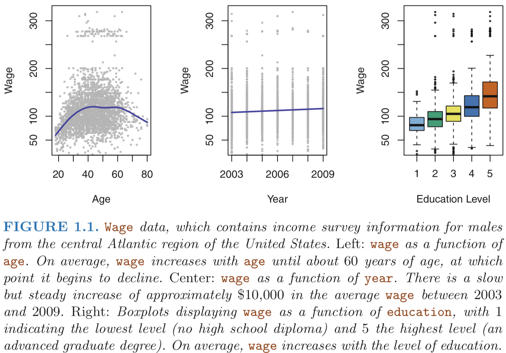
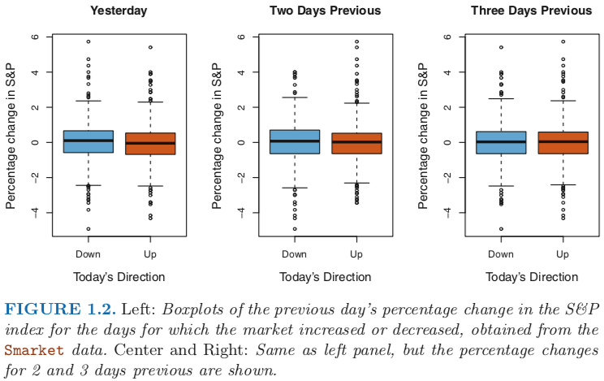
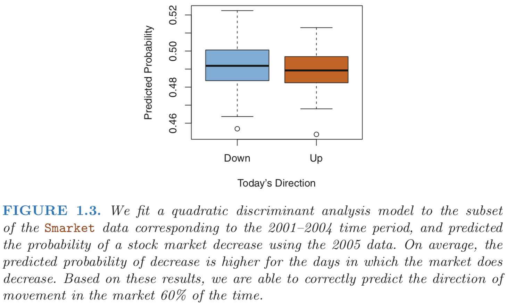
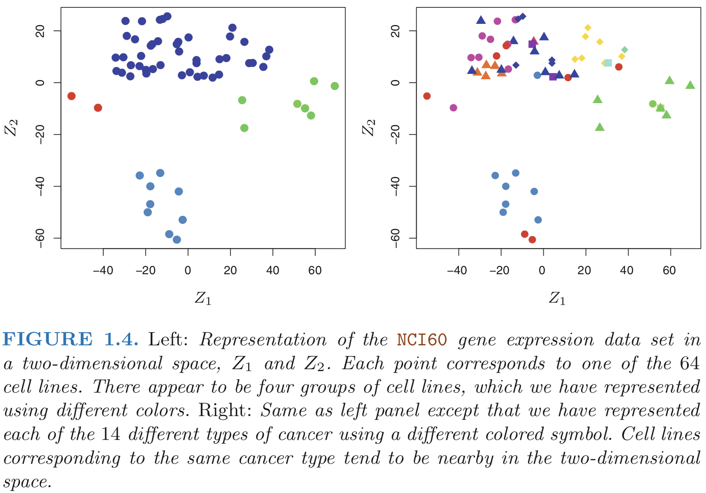

# Statistical Learning

Based on the youngest brother of _The Elements of Statistical Learning (ESL)_: _An Introduction to Statistical Learning_

Statistical learning **refers to a set of tools for modeling and understanding complex datasets**. It is a recently developed area in statistics and blends with parallel developments in computer science and, in particular, machine learning.

Tools classification:

- _**supervised**_
- _**unsupervised**_

#### Supervised statistical learning (predict an output variable)
Involves building a statistical model for predicting, or estimating, an output based on one or more inputs. Problems of this nature occur in fields as diverse as business, medicine, astrophysics, and public policy.

#### Unsupervised statistical learning
In this case there are inputs but no supervising output; nevertheless we can learn relationships and structure from such data. It involves situations in which we only observe input variables, with no corresponding output. For example, in a marketing setting, we might have demographic information for a number of current or potential customers. We may wish to understand which types of customers are similar to each other by grouping individuals according to their observed characteristics. This is known as a clustering problem.

#### Wage Data
The Wage data involves predicting a continuous or quantitative output value. This is often referred to as a regression problem.

#### Stock Market Data
In certain cases we may instead wish to predict a non-numerical value—that is, a categorical or qualitative output. Here the statistical learning problem does not involve predicting a numerical value. Instead it involves—for exmple—predicting whether a given day’s stock market performance will fall into the Up bucket or the Down bucket. This is known as a classification problem.

#### Gene Expression Data

Instead of predicting a particular output variable, we are interested in determining whether there are groups, or clusters, among the cell lines based on their gene expression measurements. This is a difficult question to address, in part because there are thousands of gene expression measurements per cell line, making it hard to visualize the data.

