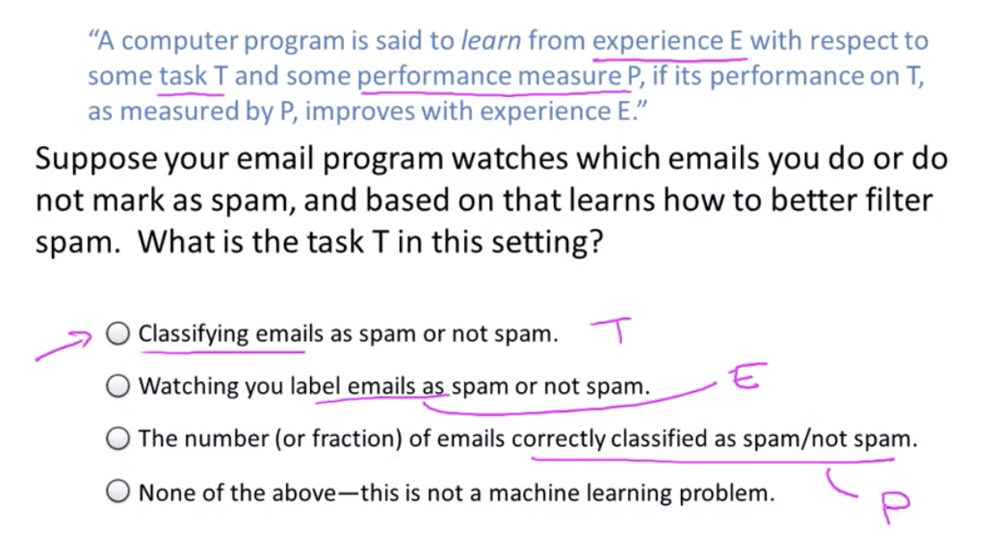

# Introduction to Machine Learning

It is a science of getting computers to learn without being explicitly programmed.

Many scientists think the best way to make progress on this is through learning 
algorithms called neural networks, which mimic how the human brain works, and 
I'll teach you about that, too

About _machine Learning_:

* Had grown out of the field of AI
* Is a new capability for computers

Examples:

* **Database mining**
    * Large datasets from growth of automation/web
    * click-streams, medical records, biology, engineering
* **Apps can’t program by hand**
    * Autonomous helicopter, handwriting recognition, natural language processing (NLP), computer vision
        * Understanding language
        * Understanding images
      
## What is Machine Learning
Even among machine learning practitioners, there isn't a well accepted definition of what is and what isn't machine learning.

_Arthur Samuel (1950)_ defined machine learning as the field of study that gives computers the ability to learn without being explicitly programmed.

_Tom Mitchell (1998)_ A computer program is said to learn from experience _**E**_ with respect to some task _**T**_ and some performance measure _**P**_, if its performance on _**T**_, as measure by _**P**_, improves with experience _**E**_.

#### Types of learning algorithms

- _**Supervised learning**_: The idea is to teach the computer how to do something

- _**Unsupervised learning**_: In this case the computer is going to learn by itself

There are also other types of algorithms such as _reinforcement learning_ and _recommender systems_ but the two most use types of learning algorithms are probably supervised learning and unsupervised learning.

#### About the course:

_**Why do we have to use Matlab or Octave? Why not Clojure, Julia, Python, R or [Insert favourite language here]**_? A: As Prof. Ng explained in the 1st video of the Octave tutorial, he has tried teaching Machine Learning in a variety of languages, and found that students come up to speed faster with Matlab/Octave. Therefore the course was designed using Octave/Matlab, and the automatic submission grader uses those program interfaces. Octave and Matlab are optimized for rapid vectorized calculations, which is very useful in Machine Learning. R is a nice tool, but:

1. It is a bit too high level. This course shows how to actually implement the algorithms of machine learning, while R already has them implemented. Since the focus of this course is to show you what happens in ML algorithms under the hood, you need to use Octave 
2. This course offers some starter code in Octave/Matlab, which will really save you tons of time solving the tasks.