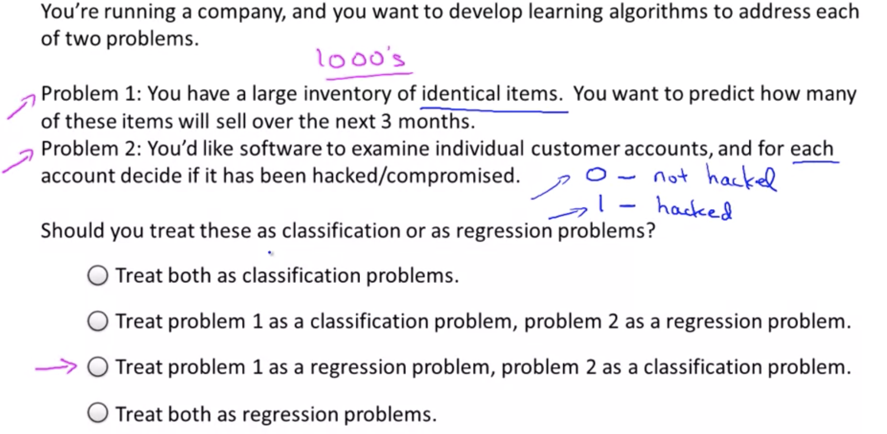

# Supervised Learning

It is probably the most common type of _ML_ problem

In _Supervised Learning_, we are given a data set and already know what our correct output should look like, having the idea that there is a relationship between the input and the output.

_Supervised Learning_ problems are categorized into "regression" and "classification" problems. In a regression problem, we are trying to predict results within a continuous output, meaning that we are trying to map input variables to some continuous function. In a classification problem, we are instead trying to predict results in a discrete output. In other words, we are trying to map input variables into discrete categories.

_Supervised Learning_ problems:

- Regression problems
- Classification problems

#### Example 1:

Given data about the size of houses on the real estate market, try to predict their price. Price as a function of size is a continuous output, so this is a regression problem.

We could turn this example into a classification problem by instead making our output about whether the house "sells for more or less than the asking price." Here we are classifying the houses based on price into two discrete categories.

#### Example 2:

(a) Regression - Given a picture of a person, we have to predict their age on the basis of the given picture

(b) Classification - Given a patient with a tumor, we have to predict whether the tumor is malignant or benign.

The term _Supervised Learning_ refers to the fact that we gave the algorithm a data set in which the, called, "right answers" were given. That is we gave it a data set of houses in which for every example in this data set, we told it what is the right price. So, what was the actual price that that house sold for, and the task of the algorithm was to just produce more of these right answers such as for this new house that your friend may be trying to sell. To define a bit more terminology, this is also called a regression problem. By **regression problem** (continuous value output), I mean we're trying to predict a continuous valued output.

Suppose you are in your dataset, you have on your horizontal axis the size of the tumor, and on the vertical axis, I'm going to plot one or zero, yes or no, whether or not these are examples of tumors we've seen before are malignant, which is one, or zero or not malignant or benign. This is an example of a **classification problem** (discrete value output). The term classification refers to the fact, that here, we're trying to predict a discrete value output zero or one, malignant or benign. It turns out that in classification problems, sometimes you can have more than two possible values for the output. As a concrete example, maybe there are three types of breast cancers.

But it turns out that for some learning problems what you really want is not to use like three or five features, but instead you want to use an infinite number of features, an infinite number of attributes, so that your learning algorithm has lots of attributes, or features, or cues with which to make those predictions.

So, how do you deal with an infinite number of features? How do you even store an infinite number of things in the computer when your computer is going to run out of memory? It turns out that when we talk about an algorithm called the Support Vector Machine, there will be a neat mathematical trick that will allow a computer to deal with an infinite number of features. Imagine that I didn't just write down two features here and three features on the right, but imagine that I wrote down an infinitely long list. I just kept writing more and more features, like an infinitely long list of features. It turns out we will come up with an algorithm that can deal with that.

