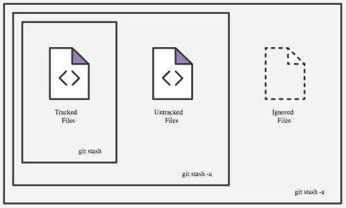

# Git stash

git stash temporarily shelves (or stashes) changes you've made to your working copy so you can work on something else, and then come back and re-apply them later on. Stashing is handy if you need to quickly switch context and work on something else, but you're mid-way through a code change and aren't quite ready to commit.

The git stash command takes your uncommitted changes (both staged and unstaged), saves them away for later use, and then reverts them from your working copy.

### git stash --include-untracked "Message to identify stash"
### git stash --all "Message to identify stash"

### git stash list

### git stash apply [id]
### git stash pop [id]

Popping your stash reapplies those changes to your working copy and removes them from your stash

### git stash drop [id]

