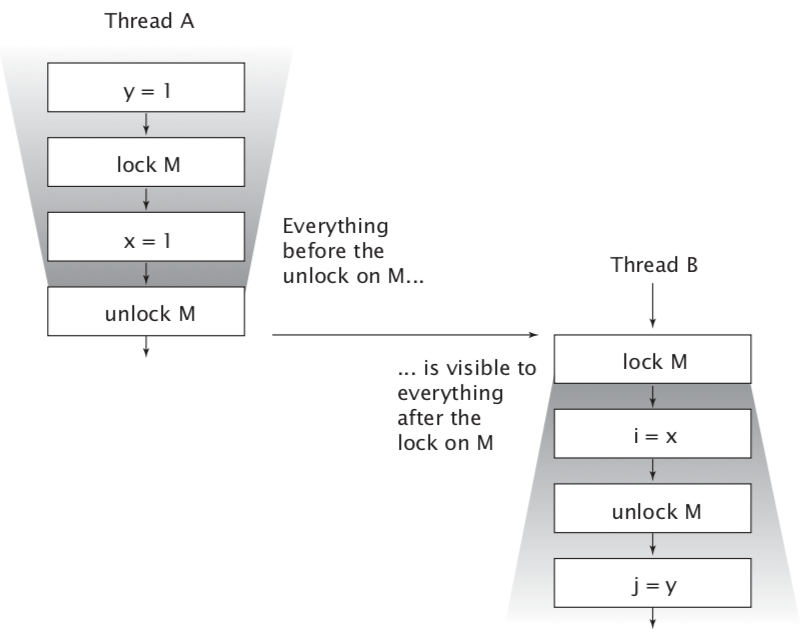
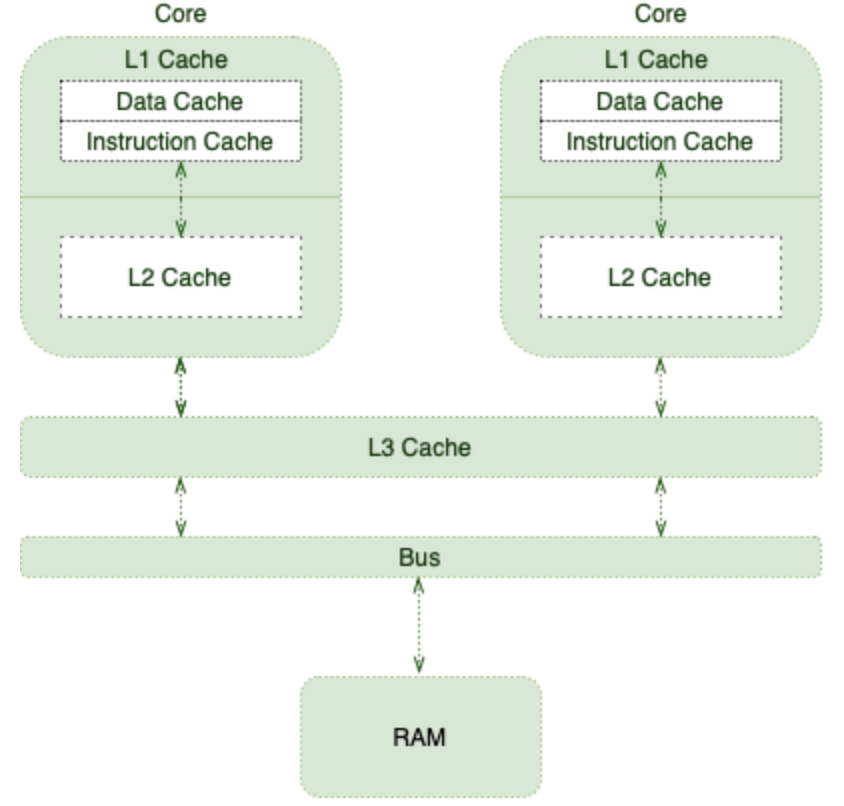

# 3. Sharing objects

## Visibility

It is a common misconception that synchronized is only about atomicity or demarcating “critical sections”. Synchronization also has another significant, and subtle, aspect: memory visibility. We want not only to prevent one thread from modifying the state of an object when another is using it, but also to ensure that when a thread modifies the state of an object, other threads can actually see the changes that were made. But without synchronization, this may not happen.

In a single-threaded environment, if you write a value to a variable and later read that variable with no intervening writes, you can expect to get the same value back. This seems only natural. But when the reads and writes occur in different threads, this is simply not the case. _**In general, there is no guarantee that the reading thread will see a value written by another thread “at the right time” basis, or even at all. In order to ensure visibility of memory writes across threads, you must use synchronization.**_

```{java}
public class NoVisibility {
  private static boolean ready; 
  private static int number;
  
  /*
    yield() provides a mechanism to inform the “scheduler” that 
    the current thread is willing to relinquish its current use 
    of processor but it'd like to be scheduled back soon as 
    possible.
  */
  
  private static class ReaderThread extends Thread { 
    public void run() {
      while (!ready)
        Thread.yield();
      
      System.out.println(number);
    }
  }
  
  public static void main(String[] args) { 
    new ReaderThread().start();
    number = 42;
    ready = true;
  }
}
```

Two threads, the main thread and the reader thread, access the shared variables ready and number. The main thread starts the reader thread and then sets number to 42 and ready to true. The reader thread spins until it sees ready is true, and then prints out number. While it may seem obvious that NoVisibility will print 42, it is in fact possible that it will print zero, or never terminate at all! Because it does not use adequate synchronization, there is no guarantee that the values of ready and number written by the main thread will be visible to the reader thread.

NoVisibility could loop forever because the value of ready might never become visible to the reader thread. Even more strangely, NoVisibility could print zero because the write to ready might be made visible to the reader thread before the write to number, a phenomenon known as reordering. _**There is no guarantee that operations in one thread will be performed in the order given by the program, as long as the reordering is not detectable from within that thread—even if the reordering is apparent to other threads[^1].**_ When the main thread writes first to number and then to ready without synchronization, the reader thread could see those writes happen in the opposite order—or not at all.

> In the absence of synchronization, the compiler, processor, and runtime can do some downright weird things to the order in which operations appear to execute. Attempts to reason about the order in which memory actions “must” happen in insufficiently synchronized multithreaded programs will almost certainly be incorrect.

> Always use the proper synchronization whenever data is shared across threads.

## Stale data

NoVisibility demonstrated one of the ways that insufficiently synchronized programs can cause surprising results: stale data. When the reader thread examines ready, it may see an out-of-date value. _**Unless synchronization is used every time a variable is accessed**_, it is possible to see a stale value for that variable. Worse, staleness is not all-or-nothing: a thread can see an up-to-date value of one variable but a stale value of another variable that was written first.

Stale values can cause serious safety or liveness failures. In NoVisibility, stale values could cause it to print the wrong value or prevent the program from terminating. Things can get even more complicated with stale values of object references, such as the link pointers in a linked list implementation. _**Stale data can cause serious and confusing failures such as unexpected exceptions, corrupted data structures, inaccurate computations, and infinite loops.**_

In a not thread-safe program where a value field is accessed from both get and set without synchronization it is susceptible to stale values: if one thread calls set, other threads calling get may or may not see that update. It can become safe by synchronizing the getter and setter. _**Synchronizing only the setter would not be sufficient: threads calling get would still be able to see stale values.**_

### Nonatomic 64-bit operations

When a thread reads a variable without synchronization, it may see a stale value, but at least it sees a value that was actually placed there by some thread rather than some random value. This safety guarantee is called out-of-thin-air safety.

Out-of-thin-air safety applies to all variables, with one exception: 64-bit numeric variables (double and long) that are not declared volatile. The Java Memory Model requires fetch and store operations to be atomic, but for nonvolatile long and double variables, the JVM is permitted to treat a 64-bit read or write as two separate 32-bit operations. If the reads and writes occur in different threads, it is therefore possible to read a nonvolatile long and get back the high 32 bits of one value and the low 32 bits of another[^2]. Thus, even if you don’t care about stale values, _**it is not safe to use shared mutable long and double variables in multithreaded programs unless they are declared volatile or guarded by a lock.**_

### Locking and visibility (piggybacking?)

When thread A executes a synchronized block, and subsequently thread B enters a synchronized block guarded by the same lock, the values of variables that were visible to A prior to releasing the lock are guaranteed to be visible to B upon acquiring the lock. In other words, everything A did in or prior to a synchronized block is visible to B when it executes a synchronized block guarded by the same lock. Without synchronization, there is no such guarantee.



> Locking is not just about mutual exclusion; it is also about memory visibility. To ensure that all threads see the most up-to-date values of shared mutable variables, the reading and writing threads must synchronize on a common lock.

### Volatile variables

The Java language also provides an alternative, weaker form of synchronization, volatile variables, to ensure that updates to a variable are propagated predictably to other threads. When a field is declared volatile, the compiler and runtime are put on notice that this variable is shared and that operations on it should not be reordered with other memory operations. Volatile variables are not cached in registers or in caches where they are hidden from other processors, so a read of a volatile variable always returns the most recent write by any thread. Yet accessing a volatile variable performs no locking and so cannot cause the executing thread to block, making volatile variables a lighter-weight synchronization mechanism than synchronized[^3]. So from a memory visibility perspective, writing a volatile variable is like exiting a synchronized block and reading a volatile variable is like entering a synchronized block.

> Use volatile variables only when they simplify implementing and veri- fying your synchronization policy; Good uses of volatile variables include ensuring the visibility of their own state, that of the object they refer to, or indicating that an important life-cycle event (such as initialization or shutdown) has occurred.

```{java}
volatile boolean asleep; 
  ...
  while (!asleep) countSomeSheep ();
```

For this example to work, the asleep flag must be volatile. Otherwise, the thread might not notice when asleep has been set by another thread. We could instead have used locking to ensure visibility of changes to asleep, but that would have made the code more cumbersome.

Volatile variables are convenient, but they have limitations. _**The most common use for volatile variables is as a completion, interruption, or status flag, such as the asleep flag**_ in above sample. Volatile variables can be used for other kinds of state information, but more care is required when attempting this. For example, the semantics of volatile are not strong enough to make the increment operation (`count++`) atomic, unless you can guarantee that the variable is written only from a single thread. (Atomic variables do provide atomic read-modify-write support and can often be used as “better volatile variables”).

> Locking can guarantee both visibility and atomicity; volatile variables can only guarantee visibility.

You can use volatile variables only when all the following criteria are met:

- Writes to the variable do not depend on its current value, or you can ensure that only a single thread ever updates the value.

- The variable does not participate in invariants with other state variables.

- Locking is not required for any other reason while the variable is being accessed.

### More about volatile

#### Overview
In the absence of necessary synchronizations, the compiler, runtime, or processors may apply all sorts of optimizations. Even though these optimizations are beneficial most of the time, sometimes they can cause subtle issues.

Caching and reordering are among those optimizations that may surprise us in concurrent contexts. Java and the JVM provide many ways to control memory order, and the volatile keyword is one of them.


#### Shared Multiprocessor Architecture
Processors are responsible for executing program instructions. Therefore, they need to retrieve both program instructions and required data from RAM.

As CPUs are capable of carrying out a significant number of instructions per second, fetching from RAM is not that ideal for them. To improve this situation, processors are using tricks like Out of Order Execution, Branch Prediction, Speculative Execution, and, of course, Caching.

This is where the following memory hierarchy comes into play:


_**As different cores execute more instructions and manipulate more data, they fill up their caches with more relevant data and instructions. This will improve the overall performance at the expense of introducing cache coherence challenges.**_

Put simply, _**we should think twice about what happens when one thread updates a cached value.**_

#### Memory Visibility (more about `NoVisibility`)

In this simple example, we have two application threads: the main thread and the reader thread. Let's imagine a scenario in which the OS schedules those threads on two different CPU cores, where:

- The main thread has its copy of ready and number variables in its core cache
- The reader thread ends up with its copies, too
- The main thread updates the cached values

On most modern processors, write requests won't be applied right away after they're issued. In fact, processors tend to queue those writes in a special write buffer. After a while, they will apply those writes to main memory all at once.

With all that being said, when the main thread updates the number and ready variables, there is no guarantee about what the reader thread may see. In other words, the reader thread may see the updated value right away, or with some delay, or never at all!

This memory visibility may cause liveness issues in programs that are relying on visibility.

#### Reordering
To make matters even worse, the reader thread may see those writes in any order other than the actual program order. For instance, since we first update the number variable:

```{java}
public static void main(String[] args) { 
    new Reader().start();
    number = 42; 
    ready = true; 
}
```

We may expect the reader thread prints 42. However, it's actually possible to see zero as the printed value!

The reordering is an optimization technique for performance improvements. Interestingly, different components may apply this optimization:

- The processor may flush its write buffer in any order other than the program order
- The processor may apply out-of-order execution technique
- The JIT compiler may optimize via reordering

To ensure that updates to variables propagate predictably to other threads, we should apply the volatile modifier to those variables. This way, we communicate with runtime and processor to not reorder any instruction involving the volatile variable. Also, processors understand that they should flush any updates to these variables right away.

#### volatile and Thread Synchronization

For multithreaded applications, we need to ensure a couple of rules for consistent behavior:

- Mutual Exclusion – only one thread executes a critical section at a time
- Visibility – changes made by one thread to the shared data are visible to other threads to maintain data consistency

synchronized methods and blocks provide both of the above properties, at the cost of application performance. `volatile` is quite a useful keyword because it can help ensure the visibility aspect of the data change without, of course, providing mutual exclusion. Thus, it's useful in the places where we're ok with multiple threads executing a block of code in parallel, but we need to ensure the visibility property.

#### Happens-Before Ordering
The memory visibility effects of volatile variables extend beyond the volatile variables themselves.

To make matters more concrete, let's suppose thread A writes to a volatile variable, and then thread B reads the same volatile variable. In such cases, _**the values that were visible to A before writing the volatile variable will be visible to B after reading the volatile variable.**_

#### Piggybacking
Because of the strength of the happens-before memory ordering, sometimes we can piggyback on the visibility properties of another volatile variable. For instance, in our particular example, we just need to mark the ready variable as volatile:

```{java}
public class TaskRunner {
 
    private static int number; // not volatile
    private volatile static boolean ready;
 
    // same as before
}
```

Anything prior to writing true to the ready variable is visible to anything after reading the ready variable. Therefore, the `number` variable piggybacks on the memory visibility enforced by the `ready` variable. Put simply, even though it's not a volatile variable, it is exhibiting a volatile behavior.

By making use of these semantics, we can define only a few of the variables in our class as volatile and optimize the visibility guarantee.

## Publication and escape

Publishing an object means making it available to code outside of its current scope, such as by storing a reference to it where other code can find it, returning it from a nonprivate method, or passing it to a method in another class. In many situations, we want to ensure that objects and their internals are not published. In other situations, we do want to publish an object for general use, but doing so in a thread-safe manner may require synchronization. _**Publishing internal state variables can compromise encapsulation and make it more difficult to preserve invariants; publishing objects before they are fully constructed can compromise thread safety. An object that is published when it should not have been is said to have escaped.**_

The most blatant form of publication is to store a reference in a public static field, where any class and thread could see it:

```{java}
public static Set<Secret> knownSecrets;

public void initialize() {
  knownSecrets = new HashSet<Secret>();
}

// Don't do this
class UnsafeStates {
  private String[] states = new String[] {
    "AK", "AL" ...
  };
  
  public String[] getStates() { return states; } 
}
```

Publishing one object may indirectly publish others. If you add a Secret to the published knownSecrets set, you’ve also published that Secret, because any code can iterate the Set and obtain a reference to the new Secret. 

Publishing states in `UnsafeStates` way is problematic because any caller can modify its contents. In this case, the states array has escaped its intended scope, because what was supposed to be private state has been effectively made public.

Whether another thread actually does something with a published reference doesn’t really matter, because the risk of misuse is still present. Once an object escapes, you have to assume that another class or thread may, maliciously or carelessly, misuse it. This is a compelling reason to use encapsulation: it makes it practical to analyze programs for correctness and harder to violate design constraints accidentally.

A final mechanism by which an object or its internal state can be published is to publish an inner class instance:

```{java}
public class ThisEscape {
  // Don't do this
  public ThisEscape(EventSource source) {
    source.registerListener ( 
      new EventListener() {
        public void onEvent(Event e) { 
          doSomething(e);
        }
      });
    }
  }
}

```

_**When `ThisEscape` publishes the `EventListener`, it implicitly publishes the enclosing `ThisEscape` instance as well, because inner class instances contain a hidden reference to the enclosing instance.**_

### Safe construction practices

`ThisEscape` illustrates an important special case of escape—when the this references escapes during construction. When the inner EventListener instance is published, so is the enclosing `ThisEscape` instance. But an object is in a predictable, consistent state only after its constructor returns, so publishing an object from within its constructor can publish an incompletely constructed object. This is true even if the publication is the last statement in the constructor. _**If the `this` reference escapes during construction, the object is considered not properly constructed.**_

> Do not allow the this reference to escape during construction.

A common mistake that can let the this reference escape during construction is to start a thread from a constructor. When an object creates a thread from its constructor, it almost always shares its this reference with the new thread, either explicitly (by passing it to the constructor) or implicitly (because the Thread or Runnable is an inner class of the owning object). The new thread might then be able to see the owning object before it is fully constructed. There’s nothing wrong with creating a thread in a constructor, but it is best not to start the thread immediately. Instead, expose a start or initialize method that starts the owned thread. Calling an overrideable instance method (one that is neither private nor final) from the constructor can also allow the this reference to escape.

If you are tempted to register an event listener or start a thread from a constructor, you can avoid the improper construction by using a private constructor and a public factory method.

```{java}
public class SafeListener {
  private final EventListener listener;
  
  private SafeListener() {
    listener = new EventListener() {
      public void onEvent(Event e) { 
        doSomething(e);
      } 
    };
  }
  
  public static SafeListener newInstance(EventSource source) { 
    SafeListener safe = new SafeListener(); 
    source.registerListener (safe.listener);
    return safe;
  } 
}
```

## Thread confinement

_**Accessing shared, mutable data requires using synchronization; one way to avoid this requirement is to not share. If data is only accessed from a single thread, no synchronization is needed. This technique, thread confinement, is one of the simplest ways to achieve thread safety.**_ When an object is confined to a thread, such usage is automatically thread-safe even if the confined object itself is not.

Examples:

- Swing: The Swing visual components and data model objects are not thread safe; instead, safety is achieved by confining them to the Swing event dispatch thread. To use Swing properly, code running in threads other than the event thread should not access these objects. (To make this easier, Swing provides the invokeLater mechanism to schedule a Runnable for execution in the event thread.) Many concurrency errors in Swing applications stem from improper use of these confined objects from another thread.

- Pooled JDBC Connection objects: The JDBC specification does not require that Connection objects be thread-safe[^4]. In typical server applications, a thread acquires a connection from the pool, uses it for processing a single request, and returns it. Since most requests, such as servlet requests or EJB (Enterprise JavaBeans) calls, are processed synchronously by a single thread, and the pool will not dispense the same connection to another thread until it has been returned, this pattern of connection management implicitly confines the Connection to that thread for the duration of the request. 

Just as the language has no mechanism for enforcing that a variable is guarded by a lock, it has no means of confining an object to a thread. Thread confinement is an element of your program’s design that must be enforced by its implementation.

The language and core libraries provide mechanisms that can help in maintaining thread confinement—local variables and the ThreadLocal class—but even with these, it is still the programmer’s responsibility to ensure that thread-confined objects do not escape from their intended thread.

### Ad-hoc thread confinement

_**Ad-hoc thread confinement describes when the responsibility for maintaining thread confinement falls entirely on the implementation.**_ Ad-hoc thread confinement can be fragile because none of the language features, such as visibility modifiers or local variables, helps confine the object to the target thread. In fact, references to thread-confined objects such as visual components or data models in GUI applications are often held in public fields.

The decision to use thread confinement is often a consequence of the decision to implement a particular subsystem, such as the GUI, as a single-threaded sub- system. _**Single-threaded subsystems can sometimes offer a simplicity benefit that outweighs the fragility of ad-hoc thread confinement[^5].**_

A special case of thread confinement applies to volatile variables. _**It is safe to perform read-modify-write operations on shared volatile variables as long as you ensure that the volatile variable is only written from a single thread.**_ In this case, you are confining the modification to a single thread to prevent race conditions, and the visibility guarantees for volatile variables ensure that other threads see the most up-to-date value.

Because of its fragility, ad-hoc thread confinement should be used sparingly; if possible, use one of the stronger forms of thread confinment (stack confinement or ThreadLocal) instead.

### Stack confinement

Stack confinement is a special case of thread confinement in which an object can only be reached through local variables. Just as encapsulation can make it easier to preserve invariants, local variables can make it easier to confine objects to a thread. Local variables are intrinsically confined to the executing thread; they exist on the executing thread’s stack, which is not accessible to other threads. Stack confinement (also called within-thread or thread-local usage, but not to be confused with the ThreadLocal library class) is simpler to maintain and less fragile than ad-hoc thread confinement.

For primitively typed local variables, such as numPairs in loadTheArk in below sample you cannot violate stack confinement even if you tried. There is no way to obtain a reference to a primitive variable, so the language semantics ensure that primitive local variables are always stack confined.

```{java}
public int loadTheArk(Collection<Animal> candidates) { 
  SortedSet<Animal> animals;
  int numPairs = 0;
  Animal candidate = null;

  // animals confined to method, don’t let them escape!
  animals = new TreeSet<Animal>(new SpeciesGenderComparator()); 
  animals.addAll(candidates);
  
  for (Animal a : animals) {
    if (candidate == null || !candidate.isPotentialMate(a)) 
      candidate = a;
    else {
      ark.load(new AnimalPair(candidate, a));
      ++numPairs;
      candidate = null;
    }
  }
  
  return numPairs;
}
```

In loadTheArk, we instantiate a TreeSet and store a reference to it in animals. At this point, there is exactly one reference to the Set, held in a local variable and therefore confined to the executing thread. However, _**if we were to publish a reference to the Set (or any of its internals), the confinement would be violated and the animals would escape.**_

> The design requirement that the object be confined to the executing thread, or the awareness that the confined object is not thread-safe, often exists only in the head of the developer when the code is written. If the assumption of within-thread usage is not clearly documented, future maintainers might mistakenly allow the object to escape.

### `ThreadLocal` (typically `private static` fields)

A more formal means of maintaining thread confinement is ThreadLocal, which allows you to associate a per-thread value with a value-holding object. _**ThreadLocal provides get and set accessor methods that maintain a separate copy of the value for each thread that uses it, so a get returns the most recent value passed to set from the currently executing thread.**_

Thread-local variables are often used to prevent sharing in designs based on mutable Singletons or global variables. For example, a single-threaded application might maintain a global database connection that is initialized at startup to avoid having to pass a Connection to every method. Since JDBC connections may not be thread-safe, a multithreaded application that uses a global connection without additional coordination is not thread-safe either. By using a ThreadLocal to store the JDBC connection, as in ConnectionHolder in below sample, each thread will have its own connection.

```{java}
private static ThreadLocal<Connection> connectionHolder = new ThreadLocal<Connection>() {
  public Connection initialValue() {
    return DriverManager.getConnection(DB_URL);
  } 
};

public static Connection getConnection() { 
  return connectionHolder.get();
}
```

When a thread calls ThreadLocal.get for the first time, initialValue is consulted to provide the initial value for that thread. The thread-specific values are stored in the Thread object itself; when the thread terminates, the thread-specific values can be garbage collected.

If you are porting a single-threaded application to a multithreaded environment, you can preserve thread safety by converting shared global variables into ThreadLocals, if the semantics of the shared globals permits this; _**an application- wide cache would not be as useful if it were turned into a number of thread-local caches.**_

> It is easy to abuse ThreadLocal by treating its thread confinement property as a license to use global variables or as a means of creating “hidden” method arguments. Like global variables, thread-local variables can detract from reusability and introduce hidden couplings among classes, and should therefore be used with care.

## Immutability

If an object’s state cannot be modified, these risks and complexities simply go away.
An immutable object is one whose state cannot be changed after construction. Immutable objects are inherently thread-safe; their invariants are established by the constructor, and if their state cannot be changed, these invariants always hold.

> Immutable objects are always thread-safe.

Immutable objects are simple. _**They can only be in one state, which is carefully controlled by the constructor.**_ One of the most difficult elements of program design is reasoning about the possible states of complex objects. Reasoning about the state of immutable objects, on the other hand, is trivial.

Immutable objects are also safer. Passing a mutable object to untrusted code, or otherwise publishing it where untrusted code could find it, is dangerous—the untrusted code might modify its state, or, worse, retain a reference to it and modify its state later from another thread. On the other hand, immutable objects cannot be subverted in this manner by malicious or buggy code, so they are safe to share and publish freely without the need to make defensive copies.

_**Neither the Java Language Specification nor the Java Memory Model formally defines immutability, but immutability is not equivalent to simply declaring all fields of an object final. An object whose fields are all final may still be mutable, since final fields can hold references to mutable objects.**_

An object is immutable if:

- Its state cannot be modified after construction.
- All its fields are final.
- It is properly constructed (the this reference does not escape during
construction).

While the Set that stores the names is mutable, the design of ThreeStooges makes it impossible to modify that Set after construction. The stooges reference is final, so all object state is reached through a final field. The last requirement, proper construction, is easily met since the constructor does nothing that would cause the this reference to become accessible to code other than the constructor and its caller.

```{java}
@Immutable
public final class ThreeStooges {
  private final Set<String> stooges = new HashSet<String>();
  
  public ThreeStooges() {
    stooges.add("Moe");
    stooges.add("Larry");
    stooges.add("Curly");
  }
  
  public boolean isStooge(String name) { 
    return stooges.contains(name);
  } 
}
```

### Final fields
The final keyword, a more limited version of the const mechanism from C++, supports the construction of immutable objects. _**Final fields can’t be modified (although the objects they refer to can be modified if they are mutable), but they also have special semantics under the Java Memory Model. It is the use of final fields that makes possible the guarantee of initialization safety that lets immutable objects be freely accessed and shared without synchronization.**_

Even if an object is mutable, making some fields final can still simplify reasoning about its state, since limiting the mutability of an object restricts its set of possible states. An object that is “mostly immutable” but has one or two mutable state variables is still simpler than one that has many mutable variables. Declaring fields final also documents to maintainers that these fields are not expected to change.

> Just as it is a good practice to make all fields private unless they need greater visibility, it is a good practice to make all fields final unless they need to be mutable.

### Example: Using volatile to publish immutable objects

Immutable objects can sometimes provide a weak form of atomicity. The factoring servlet performs two operations that must be atomic: updating the cached result and conditionally fetching the cached factors if the cached number matches the requested number. Whenever a group of related data items must be acted on atomically, consider creating an immutable holder class for them, such as `OneValueCache`[^6]:

```{java}
@Immutable
class OneValueCache {
  private final BigInteger lastNumber; 
  private final BigInteger[] lastFactors;
  
  public OneValueCache(BigInteger i, BigInteger[] factors) {
    lastNumber = i;
    lastFactors = Arrays.copyOf(factors, factors.length); 
  }
  
  public BigInteger[] getFactors(BigInteger i) {
    if (lastNumber == null || !lastNumber.equals(i))
      return null;
    else
      return Arrays.copyOf(lastFactors, lastFactors.length);
  } 
}
```
Race conditions in accessing or updating multiple related variables can be eliminated by using an immutable object to hold all the variables. With a mutable holder object, you would have to use locking to ensure atomicity; with an im- mutable one, once a thread acquires a reference to it, it need never worry about another thread modifying its state. If the variables are to be updated, a new holder object is created, but any threads working with the previous holder still see it in a consistent state.

`VolatileCachedFactorizer` uses a `OneValueCache` to store the cached number and factors. When a thread sets the volatile cache field to reference a new `OneValueCache`, the new cached data becomes immediately visible to other threads.

The cache-related operations cannot interfere with each other because `OneValueCache` is immutable and the cache field is accessed only once in each of the relevant code paths. This combination of an immutable holder object for multiple state variables related by an invariant, and a volatile reference used to ensure its timely visibility, allows `VolatileCachedFactorizer` to be thread-safe even though it does no explicit locking.

```{java}
@ThreadSafe
public class VolatileCachedFactorizer implements Servlet {
  
  private volatile OneValueCache cache = new OneValueCache(null, null);
  
  public void service(ServletRequest req, ServletResponse resp) { 
    BigInteger i = extractFromRequest(req);
    BigInteger[] factors = cache.getFactors(i);
  
    if (factors == null) {
      factors = factor(i);
      cache = new OneValueCache(i, factors); 
    }
    
    encodeIntoResponse(resp, factors); 
  }
}
```

## Safe publication

Sometimes we do want to share objects across threads, and in this case we must do so safely. Unfortunately, simply storing a reference to an object into a public field, is not enough to publish that object safely.

```{java}
// Unsafe publication
public Holder holder;
public void initialize() { 
  holder = new Holder(42);
}
```

Because of visibility problems, the Holder could appear to another thread to be in an inconsistent state, even though its invariants were properly established by its constructor! This improper publication could allow another thread to observe a partially constructed object.

### Improper publication: when good objects go bad

You cannot rely on the integrity of partially constructed objects. An observing thread could see the object in an inconsistent state, and then later see its state suddenly change, even though it has not been modified since publication[^7]. _**Because synchronization was not used to make the Holder visible to other threads, we say the Holder was not properly published.**_ Other threads could see a stale value for the holder field, and thus see a null reference or other older value even though a value has been placed in holder. But far worse, other threads could see an up-to-date value for the holder reference, but stale values for the state of the Holder. To make things even less predictable, a thread may see a stale value the first time it reads a field and then a more up-to-date value the next time.

### Immutable objects and initialization safety

Because immutable objects are so important, the Java Memory Model offers a special guarantee of initialization safety for sharing immutable objects. As we’ve seen, that an object reference becomes visible to another thread does not necessarily mean that the state of that object is visible to the consuming thread. In order to guarantee a consistent view of the object’s state, synchronization is needed.

_**Immutable objects, on the other hand, can be safely accessed even when synchronization is not used to publish the object reference. For this guarantee of initialization safety to hold, all of the requirements for immutability must be met: unmodifiable state, all fields are final, and proper construction.**_

> Immutable objects can be used safely by any thread without additional
synchronization, even when synchronization is not used to publish them.

This guarantee extends to the values of all final fields of properly constructed objects; final fields can be safely accessed without additional synchronization. However, if final fields refer to mutable objects, synchronization is still required to access the state of the objects they refer to.

### Safe publication idioms

Objects that are not immutable must be safely published, which usually entails synchronization by both the publishing and the consuming thread.

To publish an object safely, both the reference to the object and the object’s state must be made visible to other threads at the same time. A properly constructed object can be safely published by:

- Initializing an object reference from a static initializer;
- Storing a reference to it into a volatile field or AtomicReference;
- Storing a reference to it into a final field of a properly constructed object; 
- Storing a reference to it into a field that is properly guarded by a lock.

The internal synchronization in thread-safe collections means that placing an object in a thread-safe collection, such as a Vector or synchronizedList, fulfills the last of these requirements. If thread A places object X in a thread-safe collection and thread B subsequently retrieves it, B is guaranteed to see the state of X as A left it, even though the application code that hands X off in this manner has no explicit synchronization. The thread-safe library collections offer the following safe publication guarantees, even if the Javadoc is less than clear on the subject:

- Placing a key or value in a Hashtable, synchronizedMap, or ConcurrentMap safely publishes it to any thread that retrieves it from the Map (whether directly or via an iterator);

- Placing an element in a Vector, CopyOnWriteArrayList, CopyOnWriteArraySet, synchronizedList, or synchronizedSet safely publishes it to any thread that retrieves it from the collection;

- Placing an element on a BlockingQueue or a ConcurrentLinkedQueue safely publishes it to any thread that retrieves it from the queue.

Using a static initializer is often the easiest and safest way to publish objects that can be statically constructed: `public static Holder holder = new Holder(42);`

Static initializers are executed by the JVM at class initialization time; because of internal synchronization in the JVM, this mechanism is guaranteed to safely publish any objects initialized in this way

### Effectively immutable objects

The safe publication mechanisms all guarantee that the as-published state of an object is visible to all accessing threads as soon as the reference to it is visible, and if that state is not going to be changed again, this is sufficient to ensure that any access is safe.

Objects that are not technically immutable, but whose state will not be modified after publication, are called effectively immutable. They do not need to meet the strict definition of immutability; they merely need to be treated by the program as if they were immutable after they are published. Using effectively immutable objects can simplify development and improve performance by reducing the need for synchronization.

> Safely published effectively immutable objects can be used safely by any thread without additional synchronization.

### Mutable objects

If an object may be modified after construction, safe publication ensures only the visibility of the as-published state. Synchronization must be used not only to publish a mutable object, but also every time the object is accessed to ensure visibility of subsequent modifications. To share mutable objects safely, they must be safely published and be either thread-safe or guarded by a lock.

The publication requirements for an object depend on its mutability:

- Immutable objects can be published through any mechanism.
- Effectively immutable objects must be safely published.
- Mutable objects must be safely published, and must be either thread-safe or guarded by a lock.

### Sharing objects safely

Whenever you acquire a reference to an object, you should know what you are allowed to do with it. Do you need to acquire a lock before using it? Are you allowed to modify its state, or only to read it? Many concurrency errors stem from failing to understand these “rules of engagement” for a shared object. When you publish an object, you should document how the object can be accessed.

The most useful policies for using and sharing objects in a concurrent program are:

- _**Thread-confined.**_ A thread-confined object is owned exclusively by and confined to one thread, and can be modified by its owning thread.

- _**Shared read-only.**_ A shared read-only object can be accessed concurrently by multiple threads without additional synchronization, but cannot be modified by any thread. Shared read-only objects include immutable and effectively immutable objects.

- _**Shared thread-safe.**_ A thread-safe object performs synchronization internally, so multiple threads can freely access it through its public interface without further synchronization.

- _**Guarded.**_ A guarded object can be accessed only with a specific lock held. Guarded objects include those that are encapsulated within other thread-safe objects and published objects that are known to be guarded by a specific lock.

[^1]: This may seem like a broken design, but it is meant to allow JVMs to take full advantage of the performance of modern multiprocessor hardware. For example, in the absence of synchronization, the Java Memory Model permits the compiler to reorder operations and cache values in registers, and permits CPUs to reorder operations and cache values in processor-specific caches.

[^2]: When the Java Virtual Machine Specification was written, many widely used processor architectures could not efficiently provide atomic 64-bit arithmetic operations.

[^3]: Volatile reads are only slightly more expensive than nonvolatile reads on most current processor architectures.

[^4]: The connection **pool** implementations provided by application servers are thread-safe; connection _**pools**_ are necessarily accessed from multiple threads, so a non-thread-safe implementation would not make sense.

[^5]: Another reason to make a subsystem single-threaded is deadlock avoidance; this is one of the primary reasons most GUI frameworks are single-threaded.

[^6]: `OneValueCache` wouldn’t be immutable without the `copyOf` calls in the constructor and getter. `Arrays.copyOf` was added as a convenience in Java 6; clone would also work.

[^7]: The problem here is not the Holder class itself, but that the Holder is not properly published. However, Holder can be made immune to improper publication by declaring the n field to be final which would make Holder immutable.